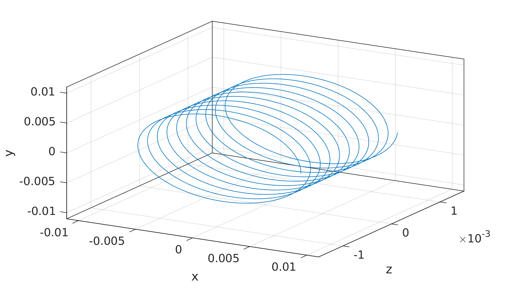
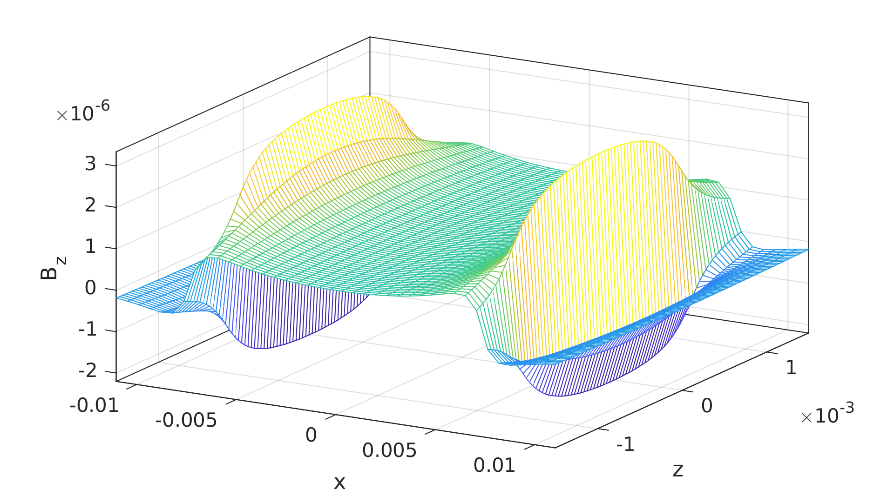

# CoilSim
Julia scripts for drawing a solenoid and numerically calculating the magnetic field from it.

## Use
To calculate the field of a coil with 125 turns, an inner diameter of 14.5 mm, and a wire diameter of 0.2 mm, run ```coilAndField.jl```.
This does the calculations and exports the results to files in the folder ```Output```.

To then find the analytic solution for the _z_ component of the field, run ```analyticalSolution.wl```.

Finally, to visualize the results, run one of ```plotResults.m``` (Matlab), ```plotResults.plt``` (gnuplot) or ```plotResults.py``` (Python/Matplotlib).
Note that only the Matlab version plots the vector field, and that the Python version does not plot the analytic solution (yet).

All these scripts include a hashbang that points to the relevant executable on my PC, so I can run them simply by typing, say:
```bash
./coilAndField.jl
```

The parameters defining the coil are set in ```defineConstants.jl```.

## Background
For my master's thesis, I needed to calculate the magnetic field generated by a coil.

After using Mathematica to play around with the analytical solution for a solenoid (modelled as a tube with a uniform current density), I thought it might be nice to have a script that could calculate the field from a conductor in 3D space, using simply the Biot-Savart law and a bit of numerical integration.

I wrote a (slow!) version in Matlab, and have now rewritten it in Julia to learn that language (and a bit of git using VS Code).

I ended up adding scripts for plotting using Gnuplot, Python (Matplotlib) and Matlab.

All in all, it ended up being a project in programming and code management, rather than electromagnetism, and took just less than a week of part-time work.

## Examples
### A coil

A coil constructed with this library.


The _z_ component of the magnetic field from the above coil.